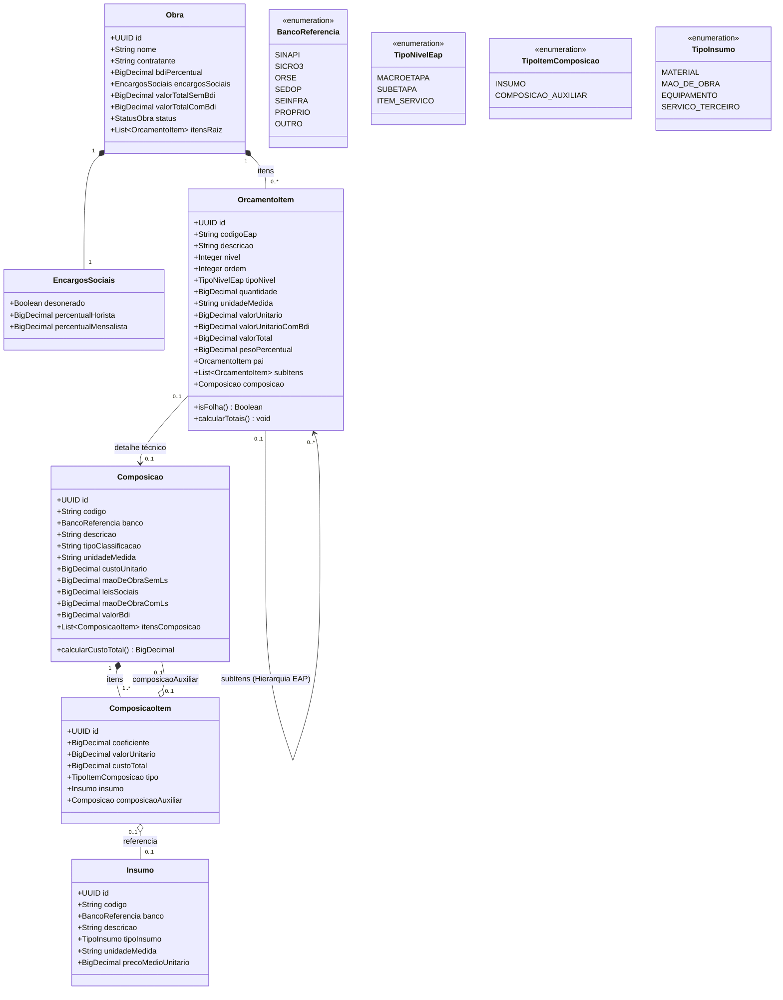

# Diagrama de Classes e Modelagem de Dados

Este documento descreve a modelagem de domínio do sistema Concordia para suportar orçamentos de obras, hierarquia EAP/WBS, serviços, composições analíticas (principais e auxiliares) e insumos.

---

## 1. Diagrama de Classes (Mermaid UML)

---

## 2. Responsabilidades das Entidades

### 2.1 `Obra` e `EncargosSociais`
- **`Obra`**: Raiz da agregação. Mantém metadados do projeto, contratante, taxa de B.D.I. global, totais consolidados e a lista de itens de primeiro nível.
- **`EncargosSociais`**: Informações de encargos de mão de obra (percentual horista, percentual mensalista e indicador de desoneração).

### 2.2 `OrcamentoItem` (Hierarquia EAP / WBS)
- Implementa o **Padrão Composite** para suportar a árvore de etapas da obra:
  - **Macroetapa (Nível 1)**: ex: `1 SERVIÇOS PRELIMINARES`
  - **Subetapa (Nível 2)**: ex: `1.1 CANTEIRO`
  - **Item de Serviço (Nível 3 / Folha)**: ex: `1.1.1 Placa de Obra`
- Itens folha possuem quantidades físicas (`quantidade`, `unidadeMedida`), preços unitários e ligação com a `Composicao`.

### 2.3 `Composicao` e `ComposicaoItem` (CPU - Composição de Preço Unitário)
- **`Composicao`**: Fórmula/receita unitária do serviço com memória de cálculo de encargos sociais, mão de obra e BDI.
- **`ComposicaoItem`**: Registra os coeficientes de consumo necessários para produzir 1 unidade da composição:
  - Pode referenciar um `Insumo` (material, mão de obra direta, equipamento).
  - Pode referenciar recursivamente outra `Composicao` (Composição Auxiliar, como argamassas preparadas ou equipes de carpinteiro/pedreiro com encargos complementares).

### 2.4 `Insumo`
- Catálogo padronizado de insumos básicos com códigos de bancos de referência (`SINAPI`, `SICRO`, `ORSE`, `SEDOP`, etc.), tipo (`MATERIAL`, `MAO_DE_OBRA`, `EQUIPAMENTO`) e preço unitário base.

---

## 3. Mapeamento dos Dados da Planilha

| Dado na Planilha Orçamentária | Entidade Correspondente | Tipo / Papel |
| :--- | :--- | :--- |
| **`1.1.1`** (Qtd: `4,50`, Total: `1.897,83`) | `OrcamentoItem` | Item Folha na EAP |
| **Composição `103689` - SINAPI** | `Composicao` | Serviço Principal |
| **Auxiliar `88262` - Carpinteiro** (Coef: `0.3729 h`) | `ComposicaoItem` $\rightarrow$ `Composicao` | Composição Auxiliar |
| **Insumo `00004509` - Sarrafo Pinus** (Coef: `3.2083 m`) | `ComposicaoItem` $\rightarrow$ `Insumo` | Insumo de Material |
